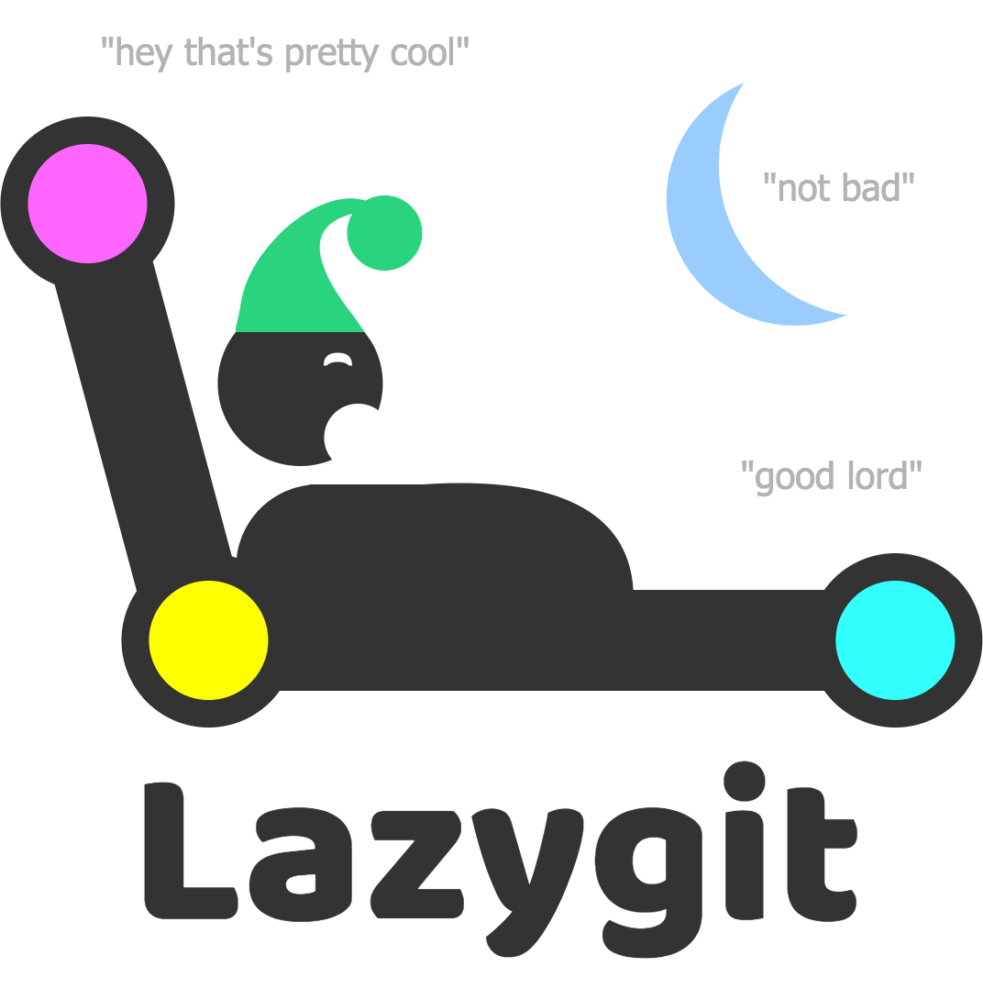

	<ul>
		
<h1 style="display: inline-block;">👋</h1>

	</ul>

I'm Gio (/d͡ʒo/), a computer scientist based in Ferrara, Italy.

<h2></h2>

### About Me

🤔 Interested in machine learning, theory of computation, AI, open source;
 
📚 Studied computer science in 🇮🇹, 🇸🇪, 🇸🇬 & 🇦🇺;
 
🌱 Working on symbolic AI at <a target="_blank" href="https://planting.space/">PlantingSpace</a>;
 
🔭 Occasionally contributing to the <a target="_blank" href="https://github.com/aclai-lab/Sole.jl">Sole.jl</a> AI framework in Julia;
 
⚡ Checkout my <a target="_blank" href="https://giopaglia.xyz/">website</a>, my
<a target="_blank" href="https://linkedin.com/in/giovanni.pagliarini/">LinkedIn</a> or my <a target="_blank" href="https://giopaglia.xyz/gio/Giovanni-Pagliarini-CV-en-latest.pdf">CV</a>.

<!--  -->
### Tools I use

<!--
  Icon sources: https://simpleicons.org (cdn.simpleicons.org/<slug>) & https://devicon.dev
  GitHub strips style="..." — size icons with width="" height="" attributes.
  Dark-mode: cdn.simpleicons.org/<slug>/<light>/<dark> switches color automatically.
  Descriptions live in the title="" tooltips (hover). Vendored icons: assets/icons/
  (fetch list at the bottom of this file).
-->

<!-- #### Science -->

<table>
  <tr>
    <td align="center" width="95">
      <a href="https://julialang.org/" title="Julia for fast prototyping">
         
        <b>Julia</b>
      </a>
    </td>
    <td align="center" width="95">
      <a href="https://www.python.org/" title="Python for fast prototyping when Julia doesn't cut it.">
         
        <b>Python</b>
      </a>
    </td>
    <td align="center" width="95">
      <a href="https://scikit-learn.org/" title="scikit-learn for classical ML.">
         
        <b>scikit-learn</b>
      </a>
    </td>
    <td align="center" width="95">
      <a href="https://plotly.com/" title="Plotly for interactive visualizations.">
         
        <b>Plotly</b>
      </a>
    </td>
    <td align="center" width="95">
      <a href="https://www.latex-project.org/" title="LaTeX for typesetting elegant reports, whitepapers, and presentations.">
         
        <b>LaTeX</b>
      </a>
    </td>
  </tr>
</table>

<!-- #### Code crafting -->

<table>
  <tr>
    <td align="center" width="95">
      <a href="https://code.visualstudio.com/" title="VS Code as my main editor.">
         
        <b>VS Code</b>
      </a>
    </td>
    <td align="center" width="95">
      <a href="https://neovim.io/" title="Neovim for quick edits and remote work.">
         
        <b>Neovim</b>
      </a>
    </td>
    <td align="center" width="95">
      <a href="https://www.sublimetext.com/" title="Sublime Text for scratchpads and huge files.">
         
        <b>Sublime Text</b>
      </a>
    </td>
    <td align="center" width="95">
      <a href="https://github.com/jesseduffield/lazygit" title="lazygit — a delightful terminal UI for git.">
         
        <b>lazygit</b>
      </a>
    </td>
  <!-- </tr> -->
  <!-- <tr> -->
    <td align="center" width="95">
      <a href="https://www.zsh.org/" title="Zsh — my shell of choice for daily driving and automation.">
         
        <b>Zsh</b>
      </a>
    </td>
    <td align="center" width="95">
      <a href="https://alacritty.org/" title="Alacritty — a fast, GPU-accelerated terminal.">
         
        <b>Alacritty</b>
      </a>
    </td>
    <td align="center" width="95">
      <a href="https://github.com/tmux/tmux" title="tmux for persistent sessions and split panes.">
         
        <b>tmux</b>
      </a>
    </td>
    <td align="center" width="95">
      <a href="https://projects.linuxmint.com/cinnamon/" title="Cinnamon — a comfortable, no-nonsense desktop environment.">
         
        <b>Cinnamon</b>
      </a>
    </td>
  </tr>
</table>

<!-- #### Productivity -->

<table>
  <tr>
    <td align="center" width="95">
      <a href="https://obsidian.md/" title="Obsidian for linked markdown notes — my second brain.">
         
        <b>Obsidian</b>
      </a>
    </td>
    <td align="center" width="95">
      <a href="https://immich.app/" title="Immich — self-hosted photo & video backup. Love it.">
         
        <b>Immich</b>
      </a>
    </td>
    <td align="center" width="95">
      <a href="https://github.com/9001/copyparty" title="copyparty — a portable file server in a single Python file.">
         
        <b>copyparty</b>
      </a>
    </td>
    <td align="center" width="95">
      <a href="https://github.com/RhetTbull/osxphotos" title="osxphotos — export and query the Apple Photos library from the CLI.">
        📷 
        <b>osxphotos</b>
      </a>
    </td>
  <!-- </tr> -->
  <!-- <tr> -->
    <td align="center" width="95">
      <a href="https://lmstudio.ai/" title="LM Studio for running local LLMs with a friendly UI.">
         
        <b>LM Studio</b>
      </a>
    </td>
    <td align="center" width="95">
      <a href="https://ollama.com/" title="Ollama for scripting against local models.">
         
        <b>Ollama</b>
      </a>
    </td>
    <td align="center" width="95">
      <a href="https://syncthing.net/" title="Syncthing for continuous peer-to-peer file sync.">
         
        <b>Syncthing</b>
      </a>
    </td>
    <td align="center" width="95">
      <a href="https://tailscale.com/" title="Tailscale — zero-config WireGuard mesh VPN connecting all my devices.">
         
        <b>Tailscale</b>
      </a>
    </td>
  </tr>
</table>

<!-- #### Modern UNIX replacements -->

[`fzf`](https://github.com/junegunn/fzf) ·
[`delta`](https://github.com/dandavison/delta) ·
[`ripgrep`](https://github.com/BurntSushi/ripgrep) ·
[`trash-cli`](https://github.com/andreafrancia/trash-cli) ·
[`lf`](https://github.com/gokcehan/lf) ·
[`lsd`](https://github.com/lsd-rs/lsd) ·
[`zoxide`](https://github.com/ajeetdsouza/zoxide)

<!--
  ── Vendored icons to fetch into assets/icons/ ─────────────────────────────
  lazygit.png    → https://user-images.githubusercontent.com/8456633/174470852-339b5011-5800-4bb9-a628-ff230aa8cd4e.png
  copyparty.png  → https://github.com/9001.png?size=84
  digikam.png    → https://invent.kde.org/graphics/digikam-->

<!-- # 📊 GitHub Stats
 
 

###
 -->
<!-- 

	
	

 -->
<!-- --- -->
<!-- ### Top Contributed Repo

	
	

 -->

<!-- Proudly created with GPRM ( https://gprm.itsvg.in ) -->

### Projects

<pre style="font-family:Menlo,'DejaVu Sans Mono',consolas,'Courier New',monospace">🛠️ Utilities
┣━━ <a href="https://github.com/giopaglia/bitsofus">bitsofus</a>                     - Takeout data enhancer utilities
┣━━ <a href="https://github.com/giopaglia/rooflini">rooflini</a>                     - Python plot roofline analyses 
┗━━ <a href="https://github.com/giopaglia/academic-grandfolks">academic-grandfolks</a>          - Trace one&#x27;s academic genealogy

☀️ Sole.jl
┣━━ 📦 Julia Packages
┃   ┣━━ <a href="https://github.com/aclai-lab/Sole.jl">Sole.jl</a>                  - framework for symbolic modeling and learning
┃   ┣━━ <a href="https://github.com/aclai-lab/SoleLogics.jl">SoleLogics.jl</a>            - model checking engine
┃   ┣━━ <a href="https://github.com/aclai-lab/SoleModels.jl">SoleModels.jl</a>            - analysis and rule extraction from symbolic models
┃   ┣━━ <a href="https://github.com/aclai-lab/SoleData.jl">SoleData.jl</a>              - optimized data structures for learning symbolic models
┃   ┗━━ <a href="https://github.com/aclai-lab/ModalDecisionTrees.jl">ModalDecisionTrees.jl</a>    - CART-like learning of trees and forests based on modal logic
┗━━ 🎙️ Talks
    ┣━━ <a href="https://www.youtube.com/watch?v=pfejOC_T5cQ">Symbolic AI workflows with Sole.jl (JuliaCon2024)</a>
    ┣━━ <a href="https://www.youtube.com/watch?v=HTRhOmQIObg">Third Millennium Symbolic Learning with Sole.jl (JuliaCon2023)</a>
    ┗━━ <a href="https://www.youtube.com/watch?v=HTRhOmQIObg">Decision Trees, Meet Modal Logics (JuliaCon2022)</a>

</pre>

